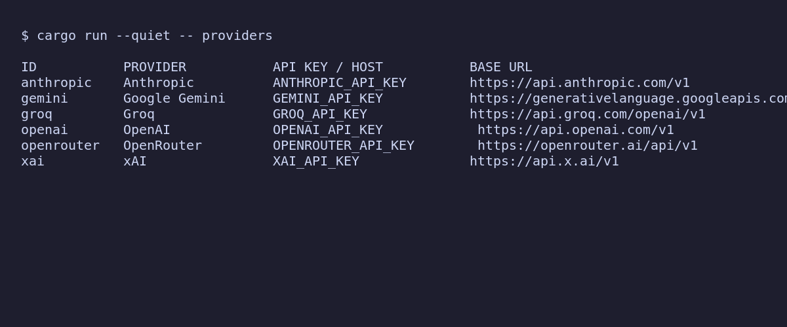

<p align="center">
  
</p>

<p align="center">Provider discovery and task execution for dependable automation.</p>

<p align="center">
  <a href="docs/cli.md">CLI reference</a> ·
  <a href="docs/providers.md">Providers</a> ·
  <a href="docs/architecture.md">Architecture</a> ·
  <a href="docs/operations.md">Operations</a> ·
  <a href="docs/roadmap.md">Roadmap</a>
</p>



Workhorse is a provider-neutral task execution project. Its Rust CLI provides fast, deterministic provider discovery and local diagnostics. The Python compatibility runtime continues to provide the original planning and execution workflow while the Rust migration progresses.

> **Current scope:** the Rust CLI does not make model requests yet. `providers` and `doctor` are local-only commands. The Python compatibility path currently uses Groq for planning and execution.

## Start here

```bash
git clone git@github-seriousaboutsolutions:seriousaboutsolutions/workhorse.git
cd workhorse
cargo run -- providers
```

Install the Rust binary when you are ready to use it outside the checkout:

```bash
cargo install --path .
workhorse --version
workhorse doctor
```

The complete command reference is in [`docs/cli.md`](docs/cli.md). The shortest path for existing Python users is in [`docs/getting-started.md`](docs/getting-started.md).

## Provider registry

The Rust registry currently describes these backends and their credential variables:

| ID | Provider | Credential or host | Protocol metadata | Rust CLI |
| --- | --- | --- | --- | --- |
| `anthropic` | Anthropic | `ANTHROPIC_API_KEY` | Anthropic Messages | Discovery |
| `gemini` | Google Gemini | `GEMINI_API_KEY` | Gemini | Discovery |
| `groq` | Groq | `GROQ_API_KEY` | OpenAI-compatible | Discovery |
| `mistral` | Mistral | `MISTRAL_API_KEY` | OpenAI-compatible | Discovery |
| `ollama` | Ollama | `OLLAMA_HOST` | OpenAI-compatible, local | Discovery |
| `openai` | OpenAI | `OPENAI_API_KEY` | OpenAI-compatible | Discovery |
| `openrouter` | OpenRouter | `OPENROUTER_API_KEY` | OpenAI-compatible | Discovery |
| `xai` | xAI | `XAI_API_KEY` | OpenAI-compatible | Discovery |

See [`docs/providers.md`](docs/providers.md) for configuration, security, and the provider contribution contract.

## Python compatibility

The legacy planner and executor remain available for current workflows:

```bash
python3 -m venv .venv
. .venv/bin/activate
pip install -e .
export GROQ_API_KEY=...
workhorse-legacy run "your task here"
```

The Python configuration schema and migration notes are documented in [`docs/getting-started.md`](docs/getting-started.md).

## Development

```bash
cargo test
python3 -m pytest tests/ -v
vhs docs/demo.tape
```

See [`docs/contributing.md`](docs/contributing.md) for local prerequisites, quality gates, release conventions, and documentation standards. Kaptaind watches the Rust, Python, test, and documentation trees; its repository policy is defined in [`kaptaind.toml`](kaptaind.toml).

## License

Workhorse is released under the MIT license.
